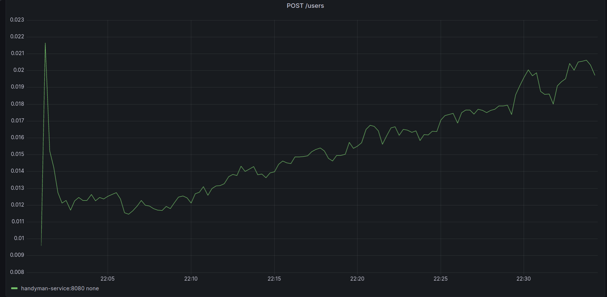

### Сделано:
 - [X] Генерация записей Gardener и Plot из стабины через CRUD ручки
 - [X] То же самое для Handyman и Account
 - [X] Добавил зависимость Account от Bank. В таблицу залил 10 банков.
 - [X] Эндпоинты для вывода статистик для банков и участков
 - [X] Скриншоты с результатами стресс тестирования из Grafana
 - [ ] Миграции с индексами
 - [ ] для шага площади передаваемого параметром запроса выводить минимальный, максимальный размер участка, среднюю площадь, количество (например указываем шаг в 10м2, должны выводиться все участки в диапазонах от 0 до 10, 10 до 20 и т.п. максимальная и минимальная площадь и т.п.)

### Результаты стресс-тестирования:
##### Количество секунд на запрос по миграции таблицы user в gardener через CRUD запросы

С ростом данных увеличивается сложность поиска сущности по email (запрос для валидации), а также вставка сущности в таблицу.

##### Количество секунд на запрос по вставке данных о поле через CRUD запросы

С ростом данных время на вставку данных о полях почти не меняется.

##### Количество секунд на запрос по миграции таблицы user в handyman через CRUD запросы

С ростом данных увеличивается сложность поиска сущности по email (запрос для валидации), а также вставка сущности в таблицу.

##### Количество секунд на запрос по вставке данных о счете через CRUD запросы

С ростом данных время на вставку почти не меняется